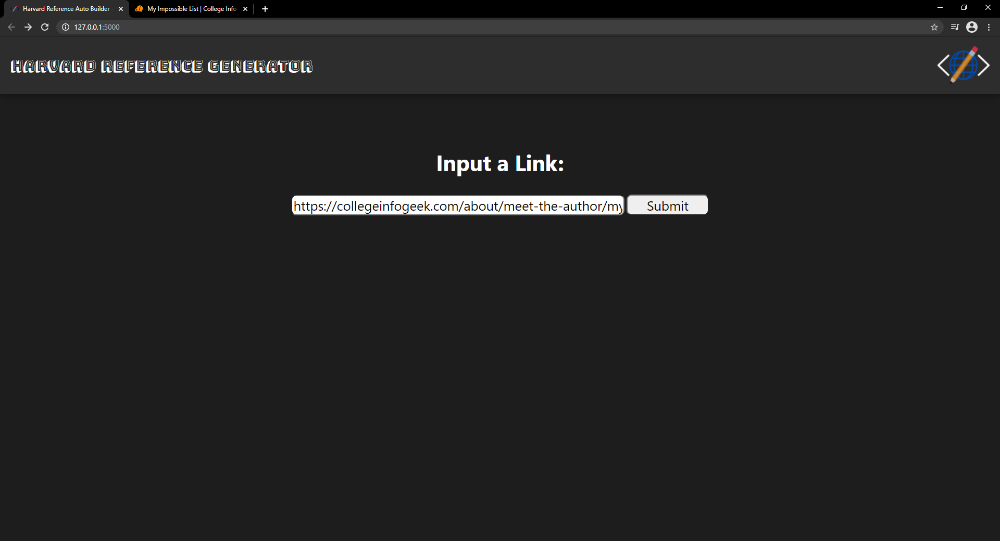

# Harvard-Reference-Generator
Generate Harvard References by just putting a URL into the box! It will get all the information to build the Harvard Reference without you having to find it yourself.

## Motivation
This project was made because copying and pasting the author, article title, name of the website, year of publication, full URL and the date I last visited the site into Harvard Style Reference Generators felt a bit tedious, and it was even more tedious when writing the reference manually! The aim of this project is to make Harvard Reference generation a lot less tedious and save time.

## Tech/Framework Used
This project uses Flask, which is a third-party library that is used as a web framework. Python is used for the backend. HTML, CSS and JavaScript are used for the front-end.
See the [Flask Documentation](https://flask.palletsprojects.com/en/1.1.x/) for more information.

## Installation
This project does not have a public website yet.

To install:
- Clone the project via your terminal: `git clone https://github.com/cBridges851/Harvard-Reference-Generator.git`

- Install Flask via your terminal: `pip install flask`
See [Flask's Documentation on Installation](https://flask.palletsprojects.com/en/1.1.x/installation/) if you need any more assistance.

## How To Use
- Execute `flask run` in the root folder (which should contain app.py) to run the application, and open the URL that is given.

- Paste the URL you wish to generate the Harvard Reference into the box and press submit.

- The Harvard Reference should be outputted to the page.

- Not the output you were expecting? Click the link at the bottom of the above page and fill in the details of the information you were expecting to see in the Harvard Reference.

- When you press the submit button, the information you provided will be sent to our database, we will sort the issue and get in contact with you via your provided email, and a Harvard Reference based on what you were expecting is generated.

## License
This project uses the  [GPL-3.0 License](https://github.com/cBridges851/Harvard-Referencing-Auto-Builder/blob/main/LICENSE)
